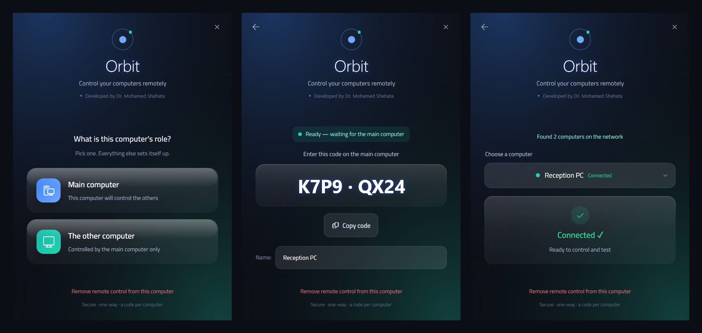
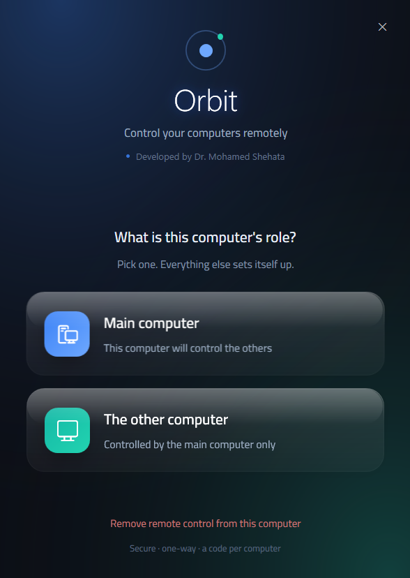
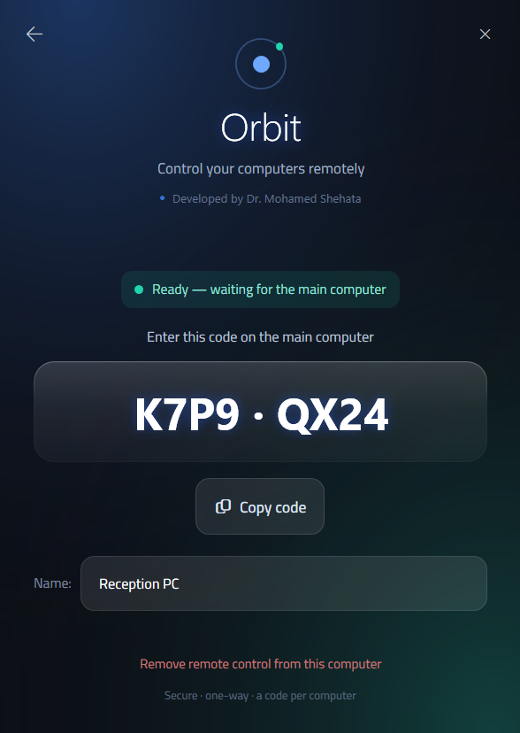
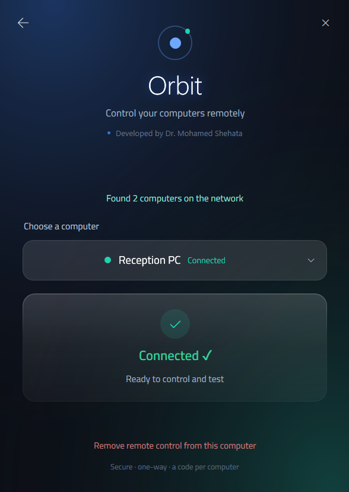
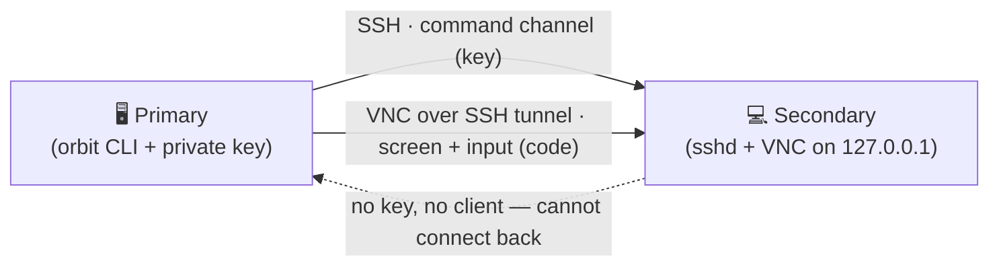

<div align="center">

# 🛰️ Orbit

### Securely control your other Windows PCs — from one primary machine

A liquid-glass remote-control app with a one-way, key-based security model

[](LICENSE)




</div>

---

## Overview

**Orbit** turns one Windows machine into a **primary** that can drive any number of **secondary** machines on the same network — run commands, read logs, watch the screen, and click buttons — **strictly one way**. A secondary can never reach back to the primary. It's built for a real need: testing and supporting an app running on other people's laptops without handing anyone your passwords.

Two channels per device:

| Channel | Tech | What it's for |
|---|---|---|
| **Commands** | SSH (key auth) | Run tests, read logs, launch headless tools |
| **Screen (computer-use)** | VNC over an SSH tunnel | See the screen and drive mouse + keyboard |

The interface is a single, dependency-free **WPF** window with a frosted "liquid glass" look and the **Cairo** typeface embedded, so it renders identically on any machine — no runtime to install.

---

## Features

- 🔒 **One-way by design** — a secondary only ever holds the primary's *public* key and runs no client; it is structurally unable to connect back.
- 🔑 **Key + per-device code** — SSH is key-authenticated (no passwords on the wire); each secondary shows an 8-character code that gates its screen channel and is stored DPAPI-encrypted on the primary.
- 🖥️ **Real computer-use** — screenshot, mouse, and keyboard over the wire, so you can judge *how a UI looks and behaves*, not just what code returns.
- 🛡️ **Screen stays private to the LAN** — the VNC server binds to `127.0.0.1` and is reached only through the encrypted SSH tunnel.
- 🎨 **Liquid-glass UI, zero install** — native WPF + acrylic, embedded Cairo font, fully custom glass controls (no native combo boxes).
- 🤖 **Scriptable CLI** — a small `orbit` command lets any automation or script list, ssh, screenshot, click, type, and tunnel to paired devices.
- ↩️ **Clean uninstall** — one click restores a machine to exactly how it was.

## Screenshots

| Choose a role | Secondary shows a code | Connected on the primary |
|:---:|:---:|:---:|
|  |  |  |

---

## How it works



1. **Primary** holds a private key (`~/.ssh/orbit_primary`) and the `orbit` CLI. It runs no inbound service.
2. **Secondary** trusts only the primary's *public* key for SSH, and runs a loopback-only VNC server. Its firewall allows SSH inbound; the screen channel is never exposed to the network.
3. The primary reaches the screen by opening an SSH tunnel and speaking VNC through it — so the same key that authorizes commands also protects the pixels.

---

## Security model

- **Direction is enforced, not promised.** The private key lives only on the primary; secondaries receive the public half. The primary listens for nothing. Remove the private key and *nothing* can drive anything.
- **No passwords cross the wire.** SSH uses public-key auth. The device code is the VNC password, kept as an obfuscated blob on the secondary and DPAPI-encrypted (bound to your Windows account) on the primary.
- **Per-device codes.** Compromising one device's code never affects the others.
- **Least exposure.** VNC is `LoopbackOnly`; only port 22 is opened, only on private/domain networks.

> Orbit is an administration tool for machines **you are authorized to manage**. Use it on your own devices or with the owner's consent.

---

## Quick start (Windows 10/11)

### 1 · Build your own keyed copy
Orbit is personalized to *your* primary machine's key. On the primary:

```powershell
# one-time: create your key (press Enter twice for NO passphrase — required), then build
ssh-keygen -t ed25519 -C orbit-primary -f "$env:USERPROFILE\.ssh\orbit_primary"
powershell -ExecutionPolicy Bypass -File .\build.ps1
```

This produces `Orbit.zip` (a plain folder — see [Antivirus](#antivirus-note)) carrying the scripts, the Cairo font, and *your* public key.

### 2 · Set up each secondary
Copy the `Orbit` folder to the machine → run **`Run Orbit.cmd`** → **Secondary** → approve the UAC prompt. It installs the SSH + screen channels and shows an 8-character **code**. *(The machine needs internet once, for the OpenSSH/VNC download.)*

### 3 · Pair from the primary
Run **`Run Orbit.cmd`** → **Primary** → pick the device from the list → type its code → **Connected ✓**.

---

## Command-line / automation

Once paired, drive any device from the primary (installed at `%LOCALAPPDATA%\Orbit`):

```bash
orbit list                                  # paired devices + reachability
orbit ssh    "Reception PC" "Get-Process"   # run a command, get output
orbit shot   "Reception PC" out.png         # screenshot (SSH-tunnelled VNC)
orbit click  "Reception PC" 640 360         # mouse
orbit type   "Reception PC" "hello"         # keyboard
orbit key    "Reception PC" enter           # named keys
orbit tunnel "Reception PC" 3443 3443       # forward a port (test a web app)
```

This is what makes Orbit useful for **automated testing and remote support**: a script on the primary can open a device, reproduce a UI issue visually, and verify a fix — end to end.

---

## Antivirus note

Orbit ships as a **plain folder / zip**, not a single self-extracting `.cmd`. That's deliberate: antivirus engines (Kaspersky included) flag any `.cmd` that carries encoded/compressed PowerShell as a dropper and quarantine it on sight. The readable-script folder runs cleanly.

On a **secondary**, the screen server (TightVNC) is correctly recognized as a remote-access tool — **allow it** in your AV so the screen channel works. If it's blocked, the SSH command channel still works; only live screen/click does not.

**Downloaded copy won't open?** Windows tags files from the internet ("Mark-of-the-Web"), which silently blocks the scripts. `Run Orbit.cmd` unblocks the folder automatically before launching. If it still won't open, right-click `Orbit.zip` → **Properties** → **Unblock** → OK, then extract again.

---

## Requirements

- **Windows 10/11** on every machine (WPF, OpenSSH, Windows Firewall).
- **Same local network** between primary and secondaries.
- **Python 3** on the primary (for the screen channel; `vncdotool` is installed automatically).
- **Internet once** on each secondary during setup.

## Uninstall

Open **`Run Orbit.cmd`** on any machine → **Remove** → it restores the machine (keys, services, firewall rule) to its prior state.

---

## Built with

- **WPF** (PowerShell-hosted) with DWM acrylic — the liquid-glass UI, zero install
- **[Cairo](https://github.com/google/fonts/tree/main/ofl/cairo)** typeface — SIL OFL 1.1 (bundled, see `fonts/OFL.txt`)
- **OpenSSH** — command channel & tunnel · **TightVNC** — screen server · **[vncdotool](https://github.com/sibson/vncdotool)** — screen actuator

## Author

**Dr. Mohamed Shehata**

## License

[MIT](LICENSE) — the bundled Cairo font is under the SIL Open Font License 1.1 (`fonts/OFL.txt`).
